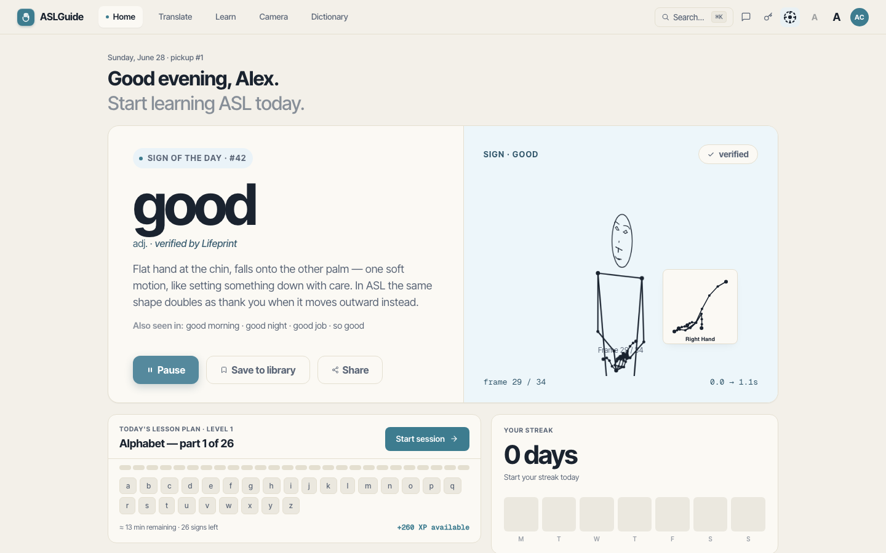
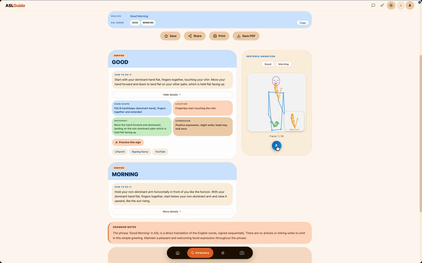
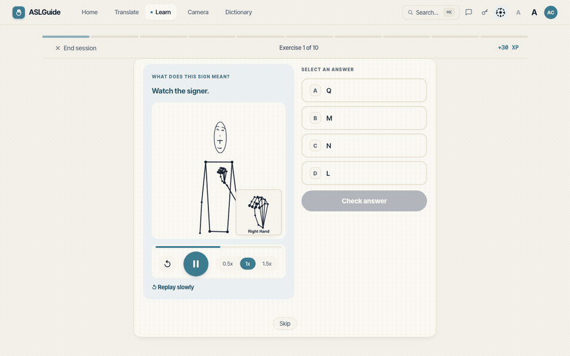
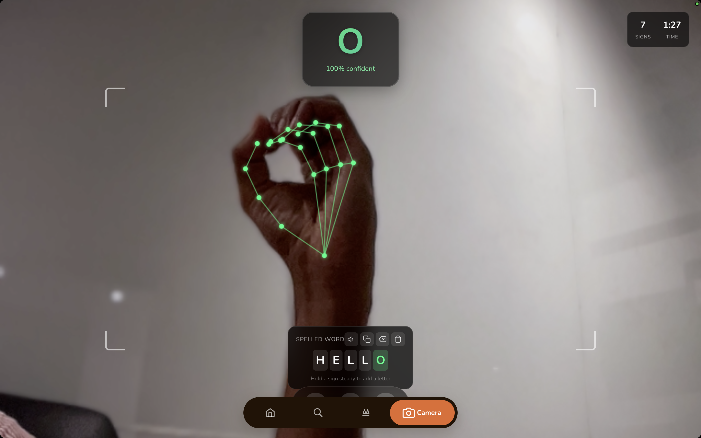

# 🤟 ASL Learning Assistant

A production-ready web app for learning American Sign Language — AI-powered sign breakdowns, animated demonstrations, and live camera recognition.

[](https://fastapi.tiangolo.com/)
[](https://react.dev/)
[](https://www.typescriptlang.org/)
[](LICENSE)

**Live App:** [https://asl-guide.onrender.com](https://asl-guide.onrender.com)

> **Note:** This is a study tool that generates AI-powered text descriptions. Always verify signs with video tutorials and practice with fluent signers for accurate learning.



---

## What it does

Type any English phrase and get a complete ASL breakdown: grammar-reordered gloss, plain-English signing instructions, animated demonstrations, and links to video resources. Browse the full sign library at `/dictionary` — 100 verified signs with category filters, A–Z sidebar, and live animation previews. A built-in learning module with spaced repetition and live camera recognition round out the app. Try it with the shared API key — no setup required.

---

## Key Features

**ASL Grammar Engine** — A two-agent Gemini pipeline applies 11 documented ASL grammar rules (Time-Topic-Comment structure, topicalization, wh-question formation, negation, conditionals, verb directionality, classifiers, and number conventions). A gloss bar shows the English → ASL reordering visually on every result.

**Verified Knowledge Base** — 100 signs (A-Z, 0–9, 12 months, 52 common signs) are backed by descriptions sourced from Lifeprint/ASLU. Each sign card shows a **Verified** or **AI generated** badge so you always know the source. Exact matches are looked up directly; synonyms can be resolved via optional semantic similarity search.

**Deterministic Fingerspelling** — Proper nouns are detected through a 3-layer pipeline (Grammar Agent gloss conventions → KB context injection → Python post-processing), not LLM output. Multi-word proper nouns like "New York City" collapse into a single fingerspelled token with a letter-by-letter breakdown on the sign card.

**100 Animated Signs** — MediaPipe landmark-based stick figure animations for the full alphabet, numbers, months, and common vocabulary. A sticky SentenceAnimator plays all signs in sequence with word chip progress indicators. The **Sign Dictionary** (`/dictionary`) lets you browse all 100 signs by category — including derived filters for Greetings (8), Family (5), and Verified only (100) — with an A–Z sidebar and live animation previews on click.

**SM-2 Spaced Repetition** — The learning module schedules signs for review using the SM-2 algorithm (ease factor, interval, repetitions). Ten progressive levels unlock at 80% mastery, with four exercise types ranging from multiple-choice to free recall and live camera practice. Sessions auto-save to localStorage so you can resume mid-session after navigating away — the level card shows "Resume session" when an incomplete session exists.

**Live Camera Recognition** — A TensorFlow.js classifier (95.5% accuracy, 36 classes: A–Z + 0–9) runs entirely in-browser via MediaPipe Hands (Tasks Vision API v0.10.32). Hold a sign for 1 second to add it to a spelled word — no server round-trip.

**Production Infrastructure** — Gemini context caching reduces grammar prompt token costs by ~73%. Dual-layer caching (Redis + in-memory LRU) handles repeat translations. PWA with Service Worker for offline use. Rate limiting, security headers, and privacy-preserving analytics with IP hashing.

---

## Screenshots

| Home | Translate | Learn | Camera |
|:---:|:---:|:---:|:---:|
|  |  |  |  |

---

## Quick Start

### Prerequisites

- Node.js 20+, Python 3.11+
- [Google Gemini API key](https://makersuite.google.com/app/apikey) (free tier available)

### Local Development

```bash
# Install dependencies
npm install
pip install -r requirements.txt

# Configure environment
cp .env.example .env
# Add GOOGLE_API_KEY to .env
```

Run both services simultaneously:

```bash
# Terminal 1 — Backend
python app.py          # http://localhost:8000

# Terminal 2 — Frontend
npm run dev            # http://localhost:5173
```

Open http://localhost:5173.

### Deploy to Render.com

Push to GitHub → connect repo as a Render Blueprint → set `GOOGLE_API_KEY` → deploy. Live in 5–10 minutes with automatic HTTPS and PR previews.

See [GEMINI.md](./GEMINI.md) for API setup details.

### Docker

```bash
docker-compose up
# or
docker build -t asl-guide . && docker run -p 8000:8000 -e GOOGLE_API_KEY=your_key asl-guide
```

---

## Tech Stack

| Layer | Technologies |
|-------|-------------|
| Frontend | React 18.3, TypeScript 5.9, Vite 7, custom Calm design system |
| Backend | FastAPI, Python 3.11+, Google Gemini 2.5 Flash |
| Browser ML | TensorFlow.js, MediaPipe Hands (Tasks Vision API) |
| Database | SQLAlchemy async, SQLite (dev) / PostgreSQL (prod) |
| Caching | Redis (optional) + in-memory LRU fallback |
| Deployment | Docker, Render.com, PWA (Service Worker + Web Manifest) |
| Testing | Vitest (19 frontend tests), pytest (28 backend tests) |

---

## Architecture

The backend uses a two-agent Gemini pipeline: a **Grammar Agent** reorders English input into ASL gloss applying 11 documented rules, then a **Translation Agent** generates sign descriptions grounded by a verified knowledge base. Results are cached at two layers (Redis + in-memory LRU). The Grammar Agent's 1,300-token system prompt is uploaded to Gemini's context cache at startup, reducing per-request input token costs by ~73%.

Full architecture, AI pipeline internals, and development guide: [CLAUDE.md](./CLAUDE.md)

Detailed docs:
- [Caching](docs/caching.md) — Translation caching, Redis setup, Gemini context cache
- [Admin Dashboard](docs/admin.md) — Analytics, feedback management, access
- [Production](docs/production.md) — Bundle sizes, optimizations, PostgreSQL, deployment notes
- [Troubleshooting](docs/troubleshooting.md) — Common issues and fixes

---

## Contributing

1. Fork the repository
2. Create your feature branch (`git checkout -b feature/AmazingFeature`)
3. Commit your changes (`git commit -m 'Add some AmazingFeature'`)
4. Push to the branch and open a Pull Request

---

## License

MIT — see [LICENSE](LICENSE)

---

## Acknowledgments

- **Bill Vicars / Lifeprint (ASLU)** — ASL education reference used for the verified sign knowledge base
- **Google Gemini** — AI-powered translation pipeline
- **Custom Calm design system** — warm off-white, ocean accent, inspired by Apple Translate / Linear / Notion
- **FastAPI & React** — Core frameworks

---

*Built with ❤️ for the ASL community*
